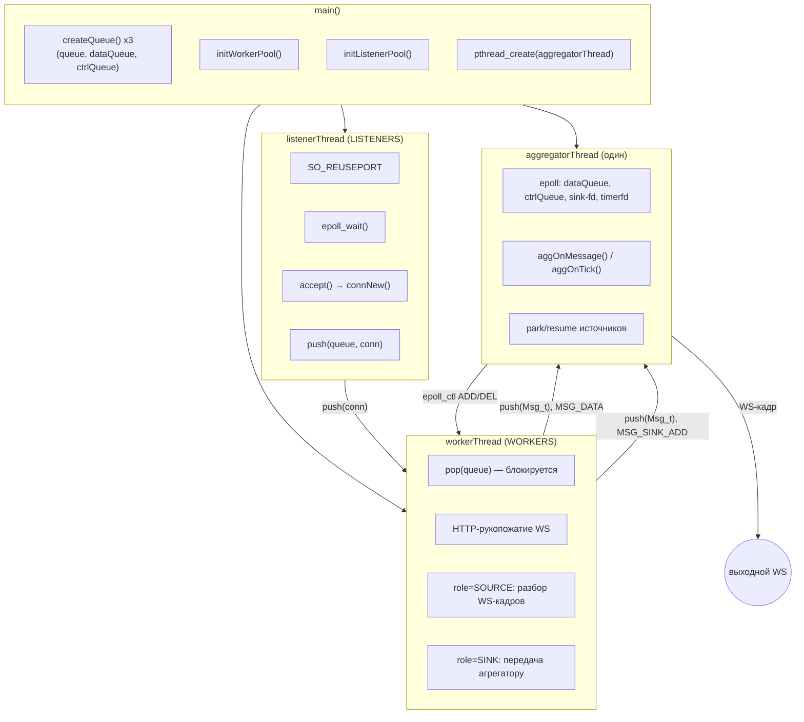
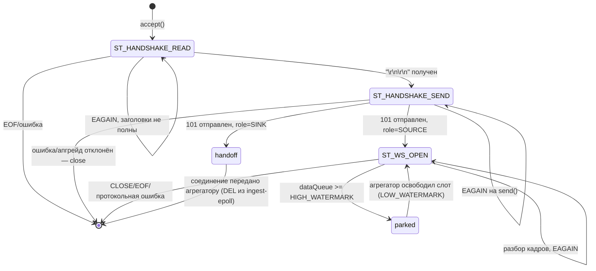

# WebSocket-агрегатор

Курсовая работа по дисциплине "Компьютерные сети"
МГТУ им. Н.Э. Баумана, 2026

## Описание

Многопоточный WebSocket-агрегатор на C17: принимает произвольное число N входящих
WebSocket-соединений-источников, прогоняет их сообщения через стадию агрегации и
отправляет результат в **единственный** выходной WebSocket. Обе стороны —
источники и выходной WS — сами подключаются к серверу; сервер никогда не
выступает WS-клиентом. Раздачи статики нет — сервер целиком посвящён протоколу
WebSocket (RFC 6455). Архитектура на приёме — **SO_REUSEPORT + Task Queue +
Thread Pool** с мультиплексированием через **epoll()**, как и в её HTTP-предке;
на выходе — отдельный однопоточный реактор-агрегатор.

---

# Техническая документация

## Оглавление

1. [Архитектура](#архитектура)
2. [Структуры данных](#структуры-данных)
3. [WebSocket-рукопожатие](#websocket-рукопожатие)
4. [Разбор и кодирование кадров](#разбор-и-кодирование-кадров)
5. [State Machine соединения](#state-machine-соединения)
6. [Backpressure: park/resume источников](#backpressure-parkresume-источников)
7. [Шов для будущих манипуляций](#шов-для-будущих-манипуляций)
8. [Потокобезопасность и время жизни](#потокобезопасность-и-время-жизни)
9. [Сборка и запуск](#сборка-и-запуск)

---

## Архитектура

### Схема потоков данных



### Разделение ролей

| Компонент | Роль |
|-----------|------|
| **Listener** | Принимает подключения, регистрирует в ingest-epoll, передаёт события в очередь |
| **Worker** | HTTP-рукопожатие WS; для источников — разбор кадров и отправка сообщений агрегатору |
| **Aggregator** | Единственный поток, обслуживающий выходной WS: агрегация + кодирование + отправка |
| **Queue_t** | Потокобезопасная очередь общего назначения (producer/consumer), носит `void*` |

Источники остаются под пулом воркеров (параллельная обработка входящего потока);
выходное соединение обслуживает **единственный** поток-агрегатор — единственный
писатель в единственный sink-сокет, поэтому кадр кодируется один раз и не требует
синхронизации при отправке. Агрегаторский поток — архитектурный близнец
`listenerThread`: тот же паттерн `epoll_create1 + горстка fd + ET-цикл`, только
вместо `accept()` он вычитывает очереди сообщений через `eventfd`.

### SO_REUSEPORT

`SO_REUSEPORT` позволяет нескольким сокетам привязаться к одному порту. Ядро
Linux автоматически распределяет входящие подключения (источники **и** попытки
подключения выходного WS — маршрутизация по пути происходит уже после
рукопожатия) между всеми слушающими сокетами.

---

## Структуры данных

### Conn_t — контекст одного TCP-соединения

```c
typedef struct Conn_t
{
    EvTag_t   tag;              /* первое поле; для диспетчеризации в epoll */
    int       fd, epollfd;      /* epollfd = -1 в момент миграции к агрегатору */
    uint64_t  id;               /* auto-increment, тег источника в сообщениях/логах */
    char      clientip[16];

    Role_t      role;           /* ROLE_UNDECIDED | ROLE_SOURCE | ROLE_SINK */
    ConnState_t state;          /* ST_HANDSHAKE_READ | ST_HANDSHAKE_SEND | ST_WS_OPEN */
    int         closeAfterSend;
    Buf_t rx, tx;                /* растущие буферы: rx — входящее, tx — ответ/control-кадры */

    /* только ROLE_SOURCE, состояние сборки текущего WS-сообщения */
    Buf_t    msg;
    uint8_t  msgOpcode;
    uint8_t  fragmenting;
    Utf8St_t msgUtf8;            /* инкрементальная проверка UTF-8 для TEXT */
    uint64_t seq;
    struct Msg_t   *pendingMsg;  /* см. Backpressure */
    struct Conn_t  *parkNext;    /* интрузивный список запаркованных источников */

    struct Conn_t *regPrev, *regNext; /* глобальный реестр — для чистого shutdown */
} Conn_t;
```

`EvTag_t` кладётся в `ev.data.ptr` **во всех** регистрациях epoll (включая
серверный сокет, `shutdownfd`, `timerfd`) — единый способ узнать в диспетчере,
что за событие пришло, без путаницы `data.fd`/`data.ptr`.

### Msg_t и Frame_t

```c
/* источник -> агрегатор; владение строго move: воркер создал → push() → агрегатор msgFree() */
typedef struct Msg_t {
    MsgKind_t kind;        /* MSG_DATA | MSG_SRC_DOWN | MSG_SINK_ADD */
    uint64_t  srcId;
    uint8_t   opcode;      /* WS_OP_TEXT | WS_OP_BIN, для MSG_DATA */
    struct timespec ts;    /* момент приёма, CLOCK_MONOTONIC — для задержки источник→sink */
    Conn_t   *conn;        /* для MSG_SINK_ADD: передаваемое соединение */
    size_t    len;
    char      data[];      /* FAM */
} Msg_t;

/* уже закодированный исходящий кадр; единственный писатель — агрегатор, refcount не нужен */
typedef struct Frame_t { size_t len; uint8_t bytes[]; } Frame_t;
```

Сообщения источников (`MSG_DATA`) идут через `dataQueue` и подчиняются
backpressure; управляющие события (`MSG_SINK_ADD` — новое подключение к
`--sink-path`, `MSG_SRC_DOWN`) идут через отдельный `ctrlQueue`, который
разбирается немедленно — иначе новый приёмник не смог бы подключиться, пока
`dataQueue` переполнена.

---

## WebSocket-рукопожатие

Рукопожатие — обычный HTTP GET (RFC 6455 п.4), поэтому разбор запроса
(`http.c`) не требует полноценного HTTP-парсера: только request line и
несколько заголовков.

| Заголовок | Проверка |
|---|---|
| `Upgrade` | должен содержать токен `websocket` (по токенам, не подстрокой — иначе `Connection: keep-alive, Upgrade` от браузеров ловился бы неверно) |
| `Connection` | должен содержать токен `Upgrade` в списке через запятую |
| `Sec-WebSocket-Version` | обязан быть `13`, иначе **426 Upgrade Required** с заголовком `Sec-WebSocket-Version: 13` |
| `Sec-WebSocket-Key` | 24 base64-символа, обязан декодироваться ровно в 16 байт |

`Sec-WebSocket-Accept = base64(sha1(key + "258EAFA5-E914-47DA-95CA-C5AB0DC85B11"))`
— свои реализации SHA-1 (`src/sha1.c`) и base64 (`src/base64.c`), без внешних
зависимостей. `Sec-WebSocket-Extensions` никогда не эхонится: без реализации
`permessage-deflate` эхо этого заголовка сломало бы поток для клиента, который
решит, что сервер сжимает данные.

Путь запроса решает роль: совпадает с `--sink-path` (по умолчанию `/feed`) —
`ROLE_SINK`, иначе — `ROLE_SOURCE` с id, который сервер присваивает сам
(auto-increment, тот же счётчик, что и для внутреннего id соединения).

---

## Разбор и кодирование кадров

`ws.c` — чистый протокол без единого системного вызова. Ключевые правила
(RFC 6455 §5):

- Клиент→сервер: маска **обязательна** (иначе close 1002). Сервер→клиент:
  маска **обязана отсутствовать** — поэтому исходящий кадр кодируется один раз
  в `Frame_t` и годится для отправки как есть.
- `RSV1-3 ≠ 0` и зарезервированные opcode (`0x3-0x7`, `0xB-0xF`) → 1002.
- Длина 126/127: неминимальная кодировка (значение, которое влезло бы в более
  короткую форму) → 1002.
- `opcode 0x0` — продолжение фрагментированного сообщения, а не новое
  сообщение; управляющие кадры (`PING`/`PONG`/`CLOSE`) могут приходить
  **между** фрагментами данных, но сами обязаны быть `FIN=1` и `len ≤ 125`.
- `CLOSE`: `len == 1` → 1002; код — BE из первых двух байт, допустимые
  диапазоны 1000-1003/1007-1011/3000-4999 (1004/1005/1006/1015 запрещены);
  остаток — reason, обязан быть валидным UTF-8.
- Лимит на размер одного кадра (`--max-frame`) проверяется **явно** сразу
  после разбора заголовка (по `payloadLen`), а не только через общий
  предохранитель на размер буфера чтения — иначе обычная пачка из нескольких
  вполне валидных кадров, пришедшая одним TCP-всплеском (частый случай при
  высокой частоте источника), ложно принималась бы за перегруз.
- UTF-8 для TEXT валидируется **инкрементально** побайтово (`wsUtf8Feed`,
  DFA по таблице RFC 3629 §3/Unicode Table 3-7) — символ может быть разрезан
  границей фрагмента; невалидная последовательность → close 1007.

---

## State Machine соединения



Разбор одного события всегда завершается ровно одним действием:
`rearmEpoll()` (вернуть в ingest-epoll), `connClose()` (закрыть), парковка
(см. ниже) или передача агрегатору — никакого fallthrough между состояниями,
в отличие от предыдущей версии сервера.

---

## Backpressure: park/resume источников

Если выходной WS ещё не подключён или не успевает читать — источники
**приостанавливаются**, а не теряют данные и не буферизуются безгранично.
Работает по единому механизму для обоих случаев: и «нет sink’а», и «sink
медленный» сводятся к «`dataQueue` не дренируется».

**Воркер**, собрав очередное сообщение:

```c
if (queueSize(conf->dataQueue) >= conf->highWatermark)
{
    c->pendingMsg = m;                      /* сообщение уже собрано, только придержали */
    parkListPush(conf->agg, c);             /* под agg->parkLock */
    epoll_ctl(c->epollfd, EPOLL_CTL_DEL, c->fd, NULL);   /* эполл НЕ меняется на -1 —
                                                             это тот же ingest-epoll */
    return DISP_PARKED;                     /* воркер идёт забирать следующую задачу */
}
push(conf->dataQueue, m);
```

**Агрегатор**, после каждого успешного `send()` в sink (слот освободился):

```c
if (queueSize(conf->dataQueue) <= conf->lowWatermark)
{
    Conn_t *c = parkListPop(agg);
    if (c) {
        push(conf->dataQueue, c->pendingMsg);
        epoll_ctl(c->epollfd, EPOLL_CTL_ADD, c->fd, &ev);   /* ADD — раньше был DEL */
    }
}
```

Почему не блокирующий `push()` на ограниченной очереди: это заняло бы поток
из воркер-пула на всё время простоя — при устойчиво медленном sink'е это
быстро съело бы весь пул. Park/resume не держит ни одного воркер-потока в
ожидании: соединение просто временно выходит из epoll.

Когда sink ещё не подключён, агрегатор **не вызывает `pop()`** вовсе — очередь
копится до `HIGH_WATERMARK`, источники паркуются тем же путём; как только
приёмник появляется, накопленное начинает вычитываться, и источники
размораживаются сами по мере продвижения.

---

## Шов для будущих манипуляций

Вся семантика агрегации заперта в `src/agg.c` за двумя функциями:

```c
/* вызывается из потока агрегатора на каждое сообщение; возвращает кадр или NULL (поглощено) */
Frame_t *aggOnMessage(Agg_t *a, const Msg_t *m);
/* вызывается по тику timerfd; сейчас — NULL + строка статистики, потом — окно/редьюс */
Frame_t *aggOnTick(Agg_t *a, const struct timespec *now);
```

Сейчас (фаза 1) — passthrough: `aggOnMessage` оборачивает TEXT в компактный
JSON с тегом источника (`{"src":.., "seq":.., "t":.., "data":..}`), BIN
передаёт как есть. Дальнейшее — окно по таймеру, редьюс, join по ключу —
локальные изменения этого файла: `aggOnMessage` перестаёт emit'ить на каждое
сообщение (копит в `AggSrc_t`), `aggOnTick` начинает эмитить накопленное.

---

## Потокобезопасность и время жизни

- **EPOLLONESHOT** на входе — после доставки события fd выключен до
  `epoll_ctl(MOD)`, поэтому с соединением в любой момент работает не более
  одного потока. На единственном sink-сокете синхронизация не нужна вовсе:
  им владеет только поток-агрегатор.
- Листенер **не закрывает** соединения сам ни при каких флагах (в т.ч.
  `EPOLLRDHUP`) — решение принимает владелец (воркер/агрегатор) после
  фактической попытки `recv()`/`send()`.
- Растущий буфер (`Buf_t`) при `EOF` сразу вслед за валидными данными в
  одном и том же `recv()` (частый случай для короткоживущих источников:
  «отправил кадр и тут же закрылся») не отбрасывает уже прочитанное —
  разбирает его, а закрывает соединение уже после разбора.
- Порядок остановки по SIGTERM: `shutdown`-флаг + `eventfd` → Listener'ы →
  `shutdownQueue` очереди воркеров → Worker'ы → `shutdownQueue` очередей
  агрегатора → Aggregator → закрытие epollfd Listener'ов → финальный проход
  по глобальному реестру соединений. Каждый шаг ждёт завершения предыдущего,
  поэтому use-after-free и зависания на `pop()` исключены по построению.
- Проверено `valgrind --leak-check=full --track-fds=yes` (0 утечек, 0
  потерянных fd) и `-fsanitize=thread` (0 гонок) под нагрузкой: fuzz-набор
  протокольных ошибок, конкурентные источники с backpressure, замена sink'а.

---

## Сборка и запуск

### Сборка

```bash
make                # Release (-O2)
make DEBUG=1         # Debug (-g)
make SAN=asan        # AddressSanitizer + UBSan
make SAN=tsan        # ThreadSanitizer (см. примечание ниже)
make clean
```

> На части систем TSan падает с `unexpected memory mapping` на PIE-бинарях
> (конфликт его фиксированной карты shadow-памяти со случайным адресом
> загрузки) — известное ограничение инструмента. Makefile уже собирает
> `SAN=tsan` без PIE (`-no-pie`); если всё равно падает, запускайте через
> `setarch $(uname -m) -R ./httpserver ...` (отключает ASLR для процесса).

### Запуск

```bash
./httpserver -p 33333 -w 8 -l 2 --sink-path /feed
./httpserver --help
```

### Опции командной строки

| Опция | Полная форма | Описание | По умолчанию |
|-------|--------------|----------|--------------|
| `-p` | `--port` | Порт сервера | 33333 |
| `-w` | `--workers` | Количество Worker потоков | 8 |
| `-l` | `--listeners` | Количество Listener потоков | 2 |
| | `--sink-path` | Путь для выходного WS | /feed |
| | `--hwm` / `--lwm` | Водяные знаки backpressure, сообщений | 256 / 128 |
| | `--max-frame` | Максимальный размер одного WS-кадра, байт | 65536 |
| | `--max-message` | Максимальный размер собранного сообщения, байт | 4194304 |
| | `--tick` | Период тика статистики/агрегации, мс | 1000 |
| `-h` | `--help` | Показать справку | — |

### Тестирование

`websocat`/`python-websockets` в окружении разработки нет — тестовый клиент
(`tests/ws_client.py`) написан на голом `socket` из stdlib:

```bash
python3 tests/ws_client.py sink ws://127.0.0.1:33333/feed
python3 tests/ws_client.py src  ws://127.0.0.1:33333/s1 --rate 5
python3 tests/ws_client.py slow-sink ws://127.0.0.1:33333/feed --hold 10   # backpressure
python3 tests/ws_client.py fuzz ws://127.0.0.1:33333/s1                    # протокольные негативные кейсы
```

Живое демо в браузере — `www/ws-demo.html` (сервер эту страницу не
раздаёт — статики больше нет; открывать напрямую).

### Остановка сервера

```bash
kill -SIGTERM <pid>   # или Ctrl+C
```

При получении сигнала сервер прекращает приём новых соединений, дожидается
завершения Worker'ов и потока-агрегатора (см. порядок выше) и освобождает
все ресурсы.

---

## Константы

| Параметр | Значение | Описание |
|----------|----------|----------|
| DEFAULT_PORT | 33333 | Порт по умолчанию |
| DEFAULT_LISTENERS | 2 | Listener потоков по умолчанию |
| DEFAULT_WORKERS | 8 | Worker потоков по умолчанию |
| MAX_LISTENERS | 16 | Максимум Listener потоков |
| MAX_WORKERS | 64 | Максимум Worker потоков |
| DEFAULT_SINK_PATH | /feed | Путь выходного WS по умолчанию |
| DEFAULT_HANDSHAKE_MAX | 8192 | Макс. размер заголовков рукопожатия, байт |
| DEFAULT_MAX_FRAME | 65536 | Макс. размер одного WS-кадра, байт |
| DEFAULT_MAX_MESSAGE | 4194304 | Макс. размер собранного сообщения, байт |
| DEFAULT_HIGH_WATERMARK | 256 | Backpressure: выше — источники паркуются |
| DEFAULT_LOW_WATERMARK | 128 | Backpressure: ниже — источники размораживаются |
| DEFAULT_TICK_MS | 1000 | Период тика статистики/агрегации |
| MAXCON | 128 | Backlog для listen() |
| MAXEVENTS | 128 | Макс. событий за epoll_wait() |

---
